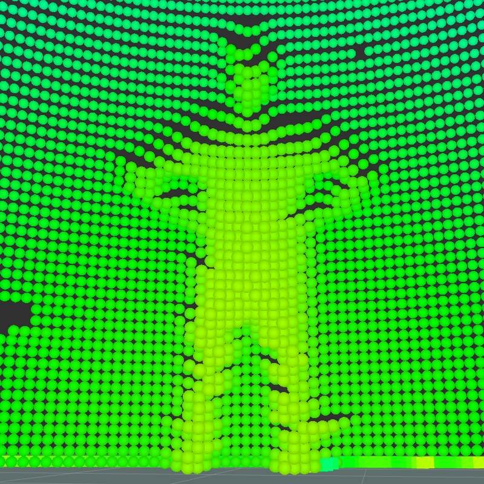
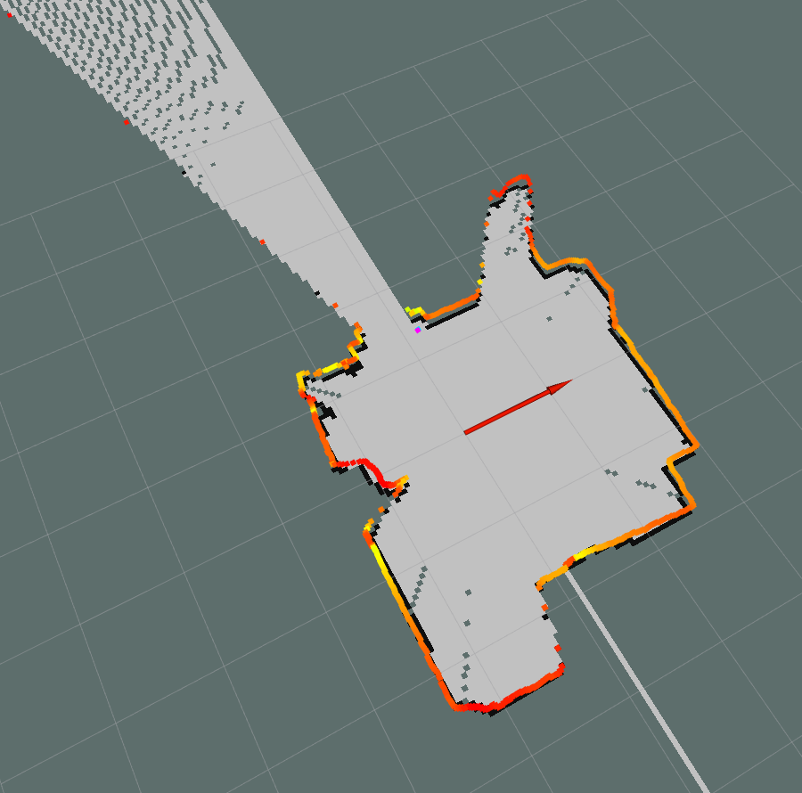
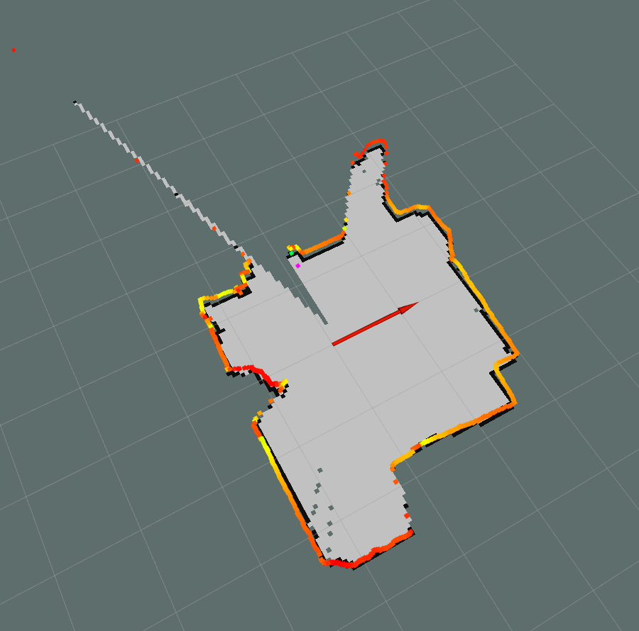
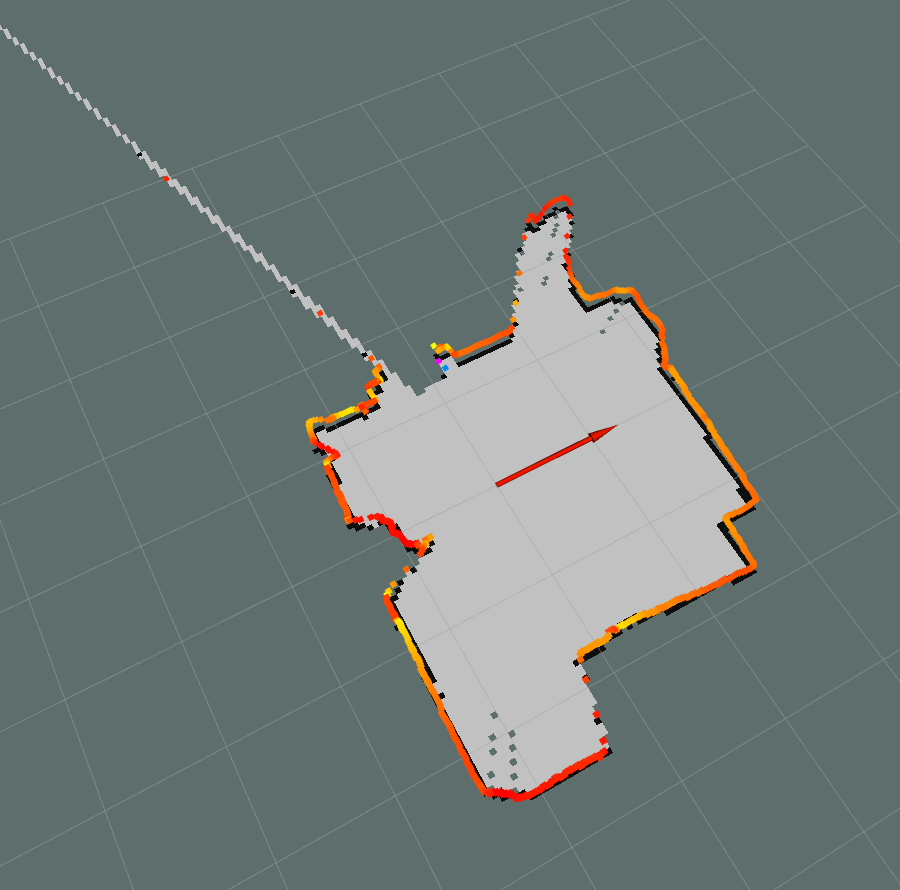

# ROSMappingRobot

> 3D space mapping with mobile Lidar on two-wheeled robot

> Raspberry Pi SLAM robot which makes 2D maps of closed spaces and can make 3D point clouds of rooms

> project made of cheap parts so you can build one on your own

## Description

The project uses mainly two big ROS packages:
- <a href="http://wiki.ros.org/gmapping">gmapping</a>
- <a href="http://wiki.ros.org/move_base">move_base</a>

It provides necessary nodes to provide full navigation stack and operate robot through RViz.

All the processing is taking place on RPI so the robot can work almost autonomously it only needs to be ordered to start scanning which can be done even via smartphone. You can monitor his work by connecting to the access point "ROSMappingRobot" password: "ROSROSROSROS" and run RViz.

By cloning the openslam_gmapping package with a small tweak from here: https://github.com/Tharazi97/openslam_gmapping. You can change the way the robot maps windows in the room from these two options:

- **Trimming to max usable range**

  
  
- **Not placing a ray on the map**

  
  
To this:

- **Using the last vailable measurment**

  